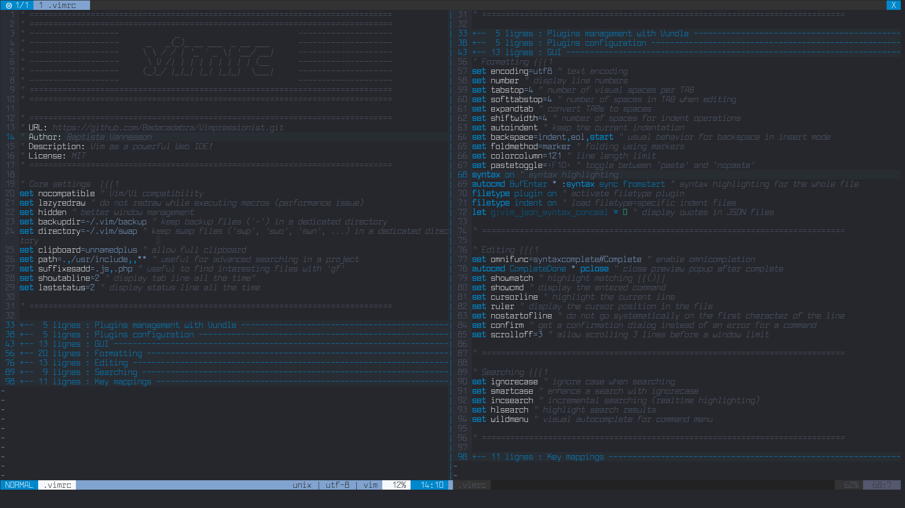
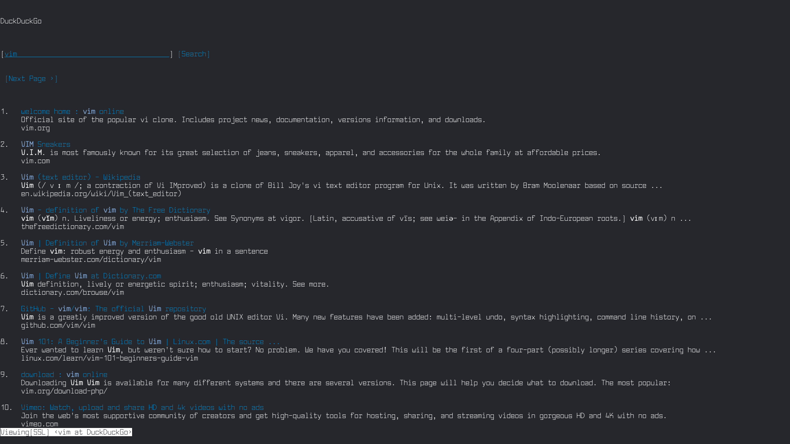
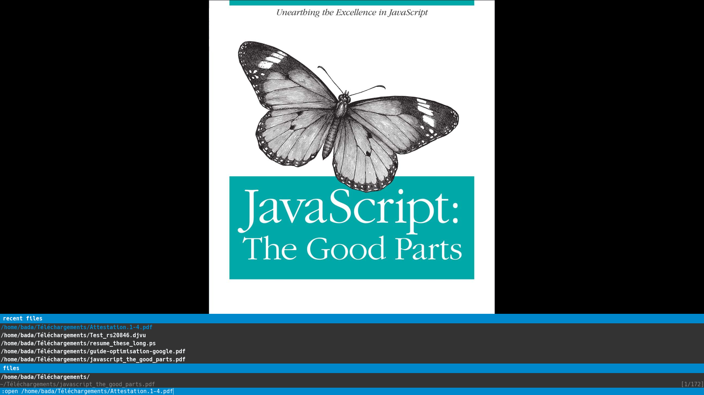

# Vimpressionist

Vimpressionist aims to be a Vim distribution for your GNU/Linux environment. It provides comprehensive and well-documented dotfiles for the main command-line software you might need. With Vimpressionist, you will have Vim-optimized key bindings and the same look & feel everywhere thanks to the [Archery](https://github.com/Badacadabra/vim-archery) colorscheme.

## Installation

Coming soon...

## Universal key mappings

These basic Vim mappings are often used:

| key         | action                    |
|:-----------:|:--------------------------|
| `h`         | Go left                   |
| `j`         | Go down                   |
| `k`         | Go up                     |
| `l`         | Go right                  |
| `gg`        | Jump to beginning         |
| `G`         | Jump to end               |
| `w`         | Save                      |
| `d`         | Delete                    |
| `q` or `ZZ` | Quit                      |
| `:`         | Enter command mode        |
| `!`         | Use shell                 |
| `/`         | Search forward            |
| `?`         | Search backward or help   |
| `CTRL-L`    | Refresh                   |
| `CTRL-E`    | Scroll one line down      |
| `CTRL-Y`    | Scroll one line up        |
| `CTRL-D`    | Scroll half page down     |
| `CTRL-U`    | Scroll half page up       |
| `CTRL-F`    | Scroll one page down      |
| `CTRL-B`    | Scroll one page up        |
| `CTRL-O`    | Go back                   |
| `CTRL-I`    | Go forth                  |

Key mappings defined in Vimpressionist have been carefully optimized to be Vim-like as much as possible. You can try to guess them while using an application, but you can of course refer to the appropriate configuration file directly.

## Available software

Thanks to all contributors who have built these nice text-based applications over the years!

---

### calcurse

> **Category:** Calendar & Scheduling application 
> **GitHub:**   [https://github.com/lfos/calcurse](https://github.com/lfos/calcurse) 
> **Website:**  [http://calcurse.org/](http://calcurse.org/)

---

### cmus

> **Category:** Music player 
> **GitHub:**   [https://github.com/cmus/cmus](https://github.com/cmus/cmus) 
> **Website:**  [https://cmus.github.io/](https://cmus.github.io/)

---

### feh

> **Category:** Image viewer 
> **GitHub:**   [https://github.com/derf/feh](https://github.com/derf/feh) 
> **Website:**  [https://feh.finalrewind.org/](https://feh.finalrewind.org/)

---

### i3

> **Category:** Tiling window manager 
> **GitHub:**   [https://github.com/i3/i3](https://github.com/i3/i3) 
> **Website:**  [http://i3wm.org/](http://i3wm.org/)

---

### Mutt

> **Category:** Email client 
> **GitHub:** [https://github.com/neomutt/neomutt](https://github.com/neomutt/neomutt) 
> **Website:** [http://www.mutt.org/](http://www.mutt.org/)

---

### Newsbeuter

> **Category:** RSS/Atom feed reader 
> **GitHub:**   [https://github.com/akrennmair/newsbeuter](https://github.com/akrennmair/newsbeuter) 
> **Website:**  [http://newsbeuter.org/](http://newsbeuter.org/)

---

### Termite

> **Category:** Terminal emulator 
> **GitHub:**   [https://github.com/thestinger/termite](https://github.com/thestinger/termite) 
> **Website:**  N/A

---

### Tig

> **Category:** Git interface 
> **GitHub:**   [https://github.com/jonas/tig](https://github.com/jonas/tig) 
> **Website:**  [https://jonas.github.io/tig/](https://jonas.github.io/tig/)

---

### Vifm

> **Category:** File manager 
> **GitHub:**   [https://github.com/vifm/vifm](https://github.com/vifm/vifm) 
> **Website:**  [https://vifm.info/](https://vifm.info/)

---

### Vim

> **Category:** Text editor 
> **GitHub:**   [https://github.com/vim/vim](https://github.com/vim/vim) 
> **Website:**  [http://www.vim.org/](http://www.vim.org/)

---

### W3M

> **Category:** Pager & Web browser 
> **GitHub:**   N/A 
> **Website:**  [http://w3m.sourceforge.net/](http://w3m.sourceforge.net/)

---

### WeeChat

> **Category:** Chat client 
> **GitHub:**   [https://github.com/weechat/weechat](https://github.com/weechat/weechat) 
> **Website:**  [https://weechat.org/](https://weechat.org/)

---

### Zathura

> **Category:** Document viewer 
> **GitHub:**   N/A 
> **Website:**  [https://pwmt.org/projects/zathura/](https://pwmt.org/projects/zathura/)

